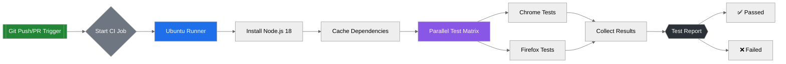

# Cypress Automation project
## Overview
This Cypress Automation Framework provides comprehensive end-to-end (E2E) testing for AutomationExercise.com,
 a demo e-commerce platform. The framework validates critical user workflows, including:
 - User authentication (signup, login, account deletion)
 - Product management (search, cart operations, checkout)
 - Order processing (payment flows)

### Built with the following features:
 - BDD Approach: Tests written in Gherkin syntax.
 - Page Object Model: Organized UI selectors and  actions.
 - Modular Design: Reusable components and steps.
 - Custom commands for reusable actions.
 - Environment management: For storage of sensitive data
 - Cross-Browser Testing: Supports Chrome, Firefox, Edge.
 - CI/CD Ready: Includes GitHub Actions workflow.

## Installation & Setup
### 1. Prerequisites
  Ensure you have these installed:
  - Node.js 
  - npm 
  - Git (for version control)

### 2. Dependencies
Dependencies were install through "npm install"
  Core Packages
  Package	                                  Version	          Purpose
  -  Cypress	                                  ^14.4.0	         End-to-end testing framework
  - @badeball/cypress-cucumber-preprocessor	  ^22.0.1	         Enables BDD/Gherkin syntax support
  - @cypress/webpack-preprocessor	              ^6.0.4	         Bundles feature files with Webpack

  Utility Packages
  Package	                                 Version	         Purpose
  - cypress-fill-command	                     ^1.0.2	             Enhances form-filling capabilities

### Dev Dependencies
  Package	                              Version	            Purpose
  - @testing-library/cypress	              ^10.0.3	            Adds Testing Library queries for better DOM testing

### Running Tests
   - Run All Tests (Headless Mode)
   "npx cypress run"

   - Open Cypress Test Runner (GUI Mode)
   "npx cypress open"

## Troubleshooting
- "Error: Module not found": Run npm install again.
- Timeout issues: Increase defaultCommandTimeout in cypress.config.js.
- Browser conflicts: Clear cache with npx cypress cache clear.

### CI/CD Integration with Parallel Testing
This CI/CD workflow leverages GitHub Actions to execute Cypress end-to-end tests in parallel across multiple
browsers, optimizing speed while ensuring comprehensive test coverage.
### Video

https://github.com/user-attachments/assets/badc0984-5eb1-474d-a718-49034687b808

### Key Features
**Parallel Test Workflow Visualization**

See Video here:
https://github.com/user-attachments/assets/badc0984-5eb1-474d-a718-49034687b808

 
